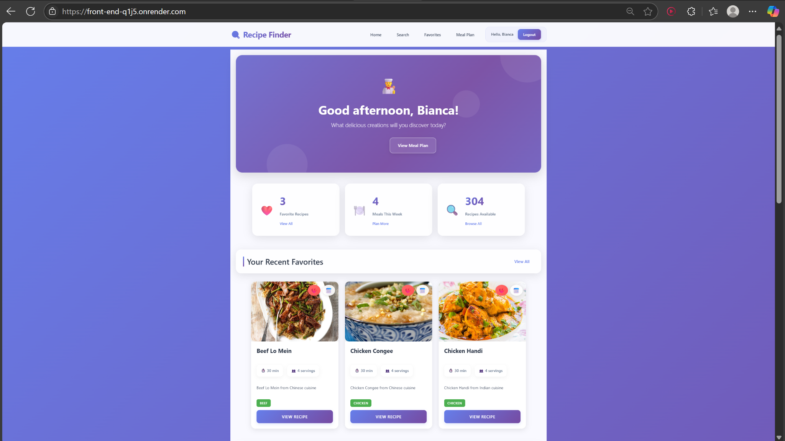
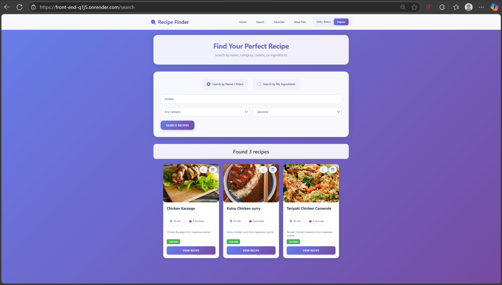
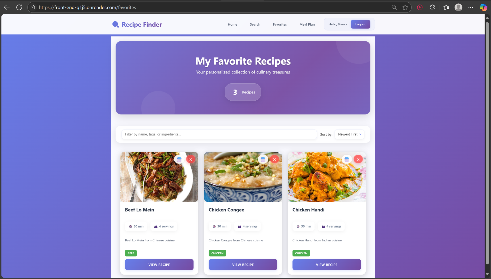
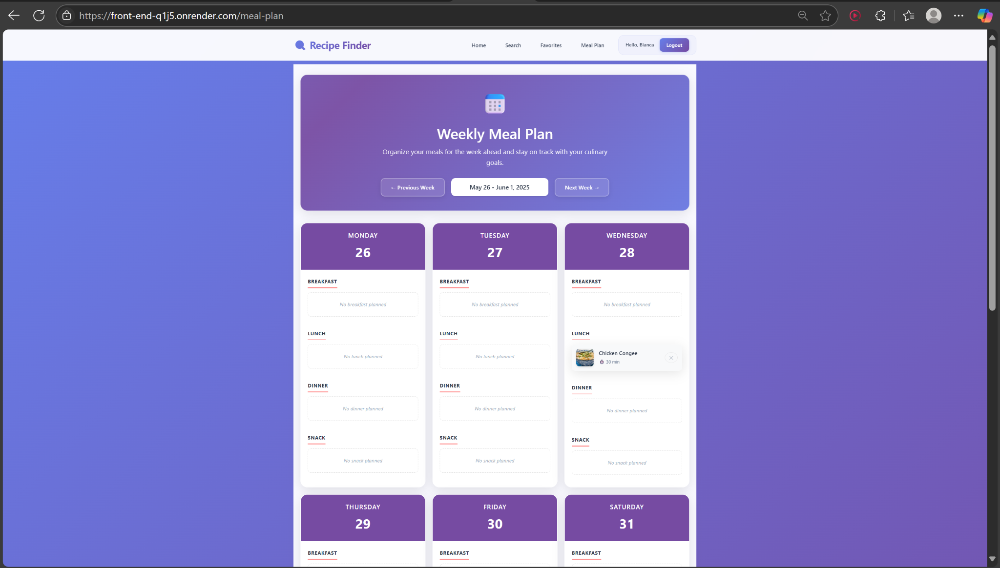
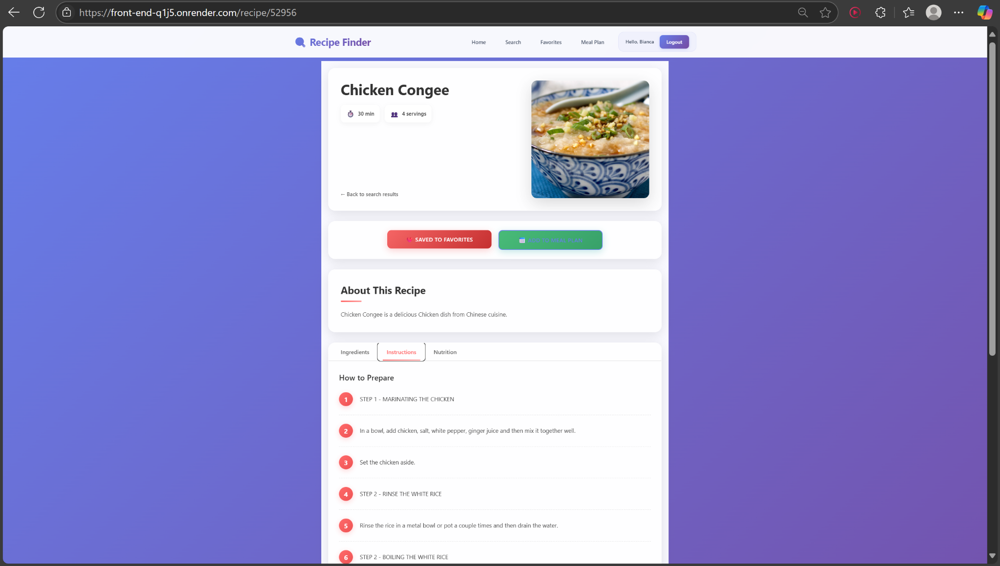

# Recipe Finder - Aplicație de Rețete Culinare, CIOBANU Bianca-Elena, 1132

Link video: https://www.youtube.com/watch?v=PvYc9oL2Oas

Link publicare: https://front-end-q1j5.onrender.com

## Introducere

Recipe Finder este o aplicație web modernă pentru căutarea, salvarea și planificarea rețetelor culinare. Permite utilizatorilor să descopere preparate din întreaga lume, să le adauge la favorite și să organizeze mesele săptămânale într-un plan personalizat. Autentificarea și stocarea datelor se face prin Firebase, iar rețetele sunt furnizate de API-ul public TheMealDB.

## Descriere problemă

O provocare frecventă în viața de zi cu zi este lipsa inspirației pentru gătit și dificultatea de a planifica mesele săptămânale. De asemenea, majoritatea aplicațiilor existente oferă doar rețete, fără o integrare coerentă între căutare, salvare și planificare. Recipe Finder rezolvă această problemă oferind o platformă intuitivă unde utilizatorii pot descoperi preparate noi, le pot salva și organiza după propriile nevoi.

## Descriere API

TheMealDB este utilizat pentru date despre rețete. Integrarea include:

1. **Căutare după nume**: `/search.php?s=query`
2. **Filtrare după categorie**: `/filter.php?c=category`
3. **Filtrare după bucătărie**: `/filter.php?a=area`
4. **Căutare după ingredient**: `/filter.php?i=ingredient`
5. **Detalii rețetă**: `/lookup.php?i=id`

Backend-ul nostru combină aceste endpoint-uri pentru a oferi o experiență mai bogată de căutare combinată (de ex. "mâncare japoneză cu pui").

### API Backend (Node.js + Firebase)

#### Rețete

| Funcționalitate           | Endpoint                      | Metodă |
|---------------------------|-------------------------------|--------|
| Căutare complexă          | `/api/recipes/complex-search` | GET    |
| Căutare după ingrediente  | `/api/recipes/search`         | GET    |
| Detalii rețetă            | `/api/recipes/:id`            | GET    |

#### Favorite

| Funcționalitate              | Endpoint                                           | Metodă |
|-----------------------------|----------------------------------------------------|--------|
| Adăugare rețetă favorită    | `/api/favorites`                                   | POST   |
| Listare favorite            | `/api/favorites/:userId`                           | GET    |
| Ștergere favorită           | `/api/favorites/:userId/:recipeId`                 | DELETE |
| Verificare rețetă favorită  | `/api/favorites/:userId/:recipeId/check`           | GET    |
| Verificare în lot favorite  | `/api/favorites/:userId/batch-check`               | POST   |

#### Planificare mese

| Funcționalitate              | Endpoint                                         | Metodă |
|-----------------------------|--------------------------------------------------|--------|
| Salvare masă în plan        | `/api/meal-plan`                                 | POST   |
| Vizualizare planificare     | `/api/meal-plan/:userId`                         | GET    |
| Ștergere masă din plan      | `/api/meal-plan/:userId/:mealId`                 | DELETE |

### Optimizări Firebase

Aplicația implementează mai multe optimizări pentru a reduce numărul de citiri Firebase:

1. **FavoritesContext**: 
   - Citire centralizată a favoritelor (în loc ca fiecare component să facă cereri)
   - Cache client-side pentru 5 minute pentru date favorite
   - Actualizări optimiste UI

2. **Endpoint-uri API Optimizate**:
   - Parametri de filtrare pentru cereri de favorite (`limit`, `since`)
   - Verificări individuale pentru starea de favorit (`/check`)
   - Verificări în lot pentru starea de favorit (`/batch-check`)

3. **Indexare Eficientă**:
   - Utilizare docID pentru acces direct la documentele favorite

Aceste optimizări reduc citirile Firebase cu 90-95% comparativ cu arhitectura inițială, prevenind depășirea cotelor Firebase.

### Frontend
- **AuthContext**: Gestionează starea de autentificare
- **FavoritesContext**: Gestionează starea rețetelor favorite (optimizat pentru Firebase)
- **RecipeCard**: Afișează o rețetă individuală
- **Pagini principale**:
  - Home: Pagina principală cu rețete populare
  - Search: Căutare rețete
  - Favorites: Rețete favorite
  - MealPlan: Planificator de mese
  - Profile: Profil utilizator

## Flux de date

Fluxul de date în aplicație începe cu autentificarea utilizatorului prin Firebase. După logare, aplicația React trimite cereri către backend-ul Express, care la rândul lui consumă date din TheMealDB (pentru rețete) și Firebase Firestore (pentru date personalizate: favorite și plan mese). Comunicarea se face prin metode HTTP (GET, POST, DELETE), iar datele sunt transmise în format JSON. Răspunsurile backend-ului sunt utilizate pentru actualizarea interfeței în timp real.

### Exemple request/response

#### Adăugare rețetă la favorite  
`POST /api/favorites`
```json
    {
      "userId": "abc123",
      "recipeId": "52772",
      "recipeData": {
        "title": "Chicken Teriyaki",
        "image": "https://...",
        "category": "Japanese",
        "area": "Japan"
      }
    }

    {
      "success": true,
      "message": "Recipe saved to favorites"
    }
```

#### Obținere lista de favorite

`GET /api/favorites/abc123`
```json
    [
      {
        "id": "52772",
        "title": "Chicken Teriyaki",
        "image": "https://...",
        "category": "Japanese",
        "area": "Japan",
        "savedAt": "2025-05-25T14:32:10.000Z"
      }
    ]
```

#### Verificare dacă o rețetă este în favorite  
`GET /api/favorites/abc123/52772/check`
```json
    {
      "isFavorited": true,
      "recipeId": "52772"
    }
```

#### Verificare în lot a mai multor rețete  
`POST /api/favorites/abc123/batch-check`
```json
    {
      "recipeIds": ["52772", "52844", "52977"]
    }

    {
      "52772": true,
      "52844": false,
      "52977": true
    }
```

#### Salvare rețetă în planificator  
`POST /api/meal-plan`
```json
    {
      "userId": "abc123",
      "date": "2025-05-26",
      "mealType": "Prânz",
      "recipeData": {
        "title": "Grilled Salmon",
        "image": "https://...",
        "category": "Seafood"
      }
    }

    {
      "success": true,
      "message": "Recipe added to meal plan"
    }
```

#### Obținere planificare mese  
`GET /api/meal-plan/abc123`
```json
    [
      {
        "id": "meal123",
        "date": "2025-05-26",
        "mealType": "Prânz",
        "recipe": {
          "title": "Grilled Salmon",
          "image": "https://..."
        },
        "createdAt": "2025-05-25T20:14:00.000Z"
      }
    ]
```

#### Ștergere rețetă din planificare  
`DELETE /api/meal-plan/abc123/meal123`
```json
    {
      "success": true,
      "message": "Meal removed from plan"
    }
```

## Capturi de ecran
### 1. Pagina principală (Homepage)


---

### 2. Pagina de căutare (Search)


---

### 3. Rețete favorite (Favorites)


---

### 4. Planificare mese (Meal Plan)


---

### 5. Pagină rețetă (Recipe Details)


## Instalare și Rulare

### Cerințe Preliminare
- Node.js (versiunea 14 sau mai recentă)
- NPM sau Yarn
- Cont Firebase (pentru stocare și autentificare)

### Pași de Instalare

1. **Clonarea Repositoriului**
   ```bash
   cd recipe-finder
   ```

2. **Instalare dependențe Frontend**
   ```bash
   cd client
   npm install
   ```

3. **Instalare dependențe Backend**
   ```bash
   cd ../server
   npm install
   ```

4. **Configurare Firebase**
   - Creați un proiect în Firebase Console
   - Activați Authentication (email/password)
   - Creați o bază de date Firestore
   - Descărcați fișierul de configurare Service Account și salvați-l ca `firebase-service-account.json` în directorul server

5. **Configurare .env**
   - În folderul `/server`, creați un fișier `.env` cu următoarele variabile:
     ```
     PORT=5000
     FIREBASE_PROJECT_ID=your-firebase-project-id
     ```
   - În folderul `/client`, creați un fișier `.env` cu următoarele variabile:
     ```
     VITE_API_URL=http://localhost:5000
     ```

6. **Pornire Server**
   ```bash
   cd server
   npm run start
   ```

7. **Pornire Client**
   ```bash
   cd client
   npm run dev
   ```

## Arhitectură

### Structura Directorului
```
recipe-finder/
├── client/                # Aplicația React Frontend
│   ├── public/            # Fișiere statice
│   ├── src/               
│   │   ├── components/    # Componente React reutilizabile
│   │   ├── contexts/      # Context API (Auth, Favorites, etc.)
│   │   ├── pages/         # Pagini principale ale aplicației
│   │   ├── services/      # Servicii API și utilități
│   │   ├── styles/        # Fișiere CSS
│   │   └── firebase/      # Configurare Firebase
│   └── index.html         # Punct de intrare HTML
├── screenshots/           # Capturi de ecran pentru documentație
├── server/                # API-ul Node.js Backend
│   ├── server.js          # Punct de intrare server
│   └── firebase-service-account.json # Configurație Firebase (ignorată in git)
└── README.md              # Documentație
```

## Utilizare

### Căutare Rețete
1. Navigați la pagina "Search"
2. Introduceți un termen de căutare sau selectați filtre
3. Răsfoiți rezultatele

### Salvare Favorite
1. Faceți click pe iconița ♡ de pe orice RecipeCard
2. Rețeta va fi salvată în contul dvs. și va putea fi accesată din pagina "Favorites"

### Planificare Mese
1. Faceți click pe iconița calendar de pe orice RecipeCard
2. Selectați data și tipul mesei
3. Vizualizați planul în pagina "Meal Plan"

## Referinţe
https://www.themealdb.com/api.php
https://firebase.google.com
https://react.dev
https://nodejs.org
https://expressjs.com
https://render.com